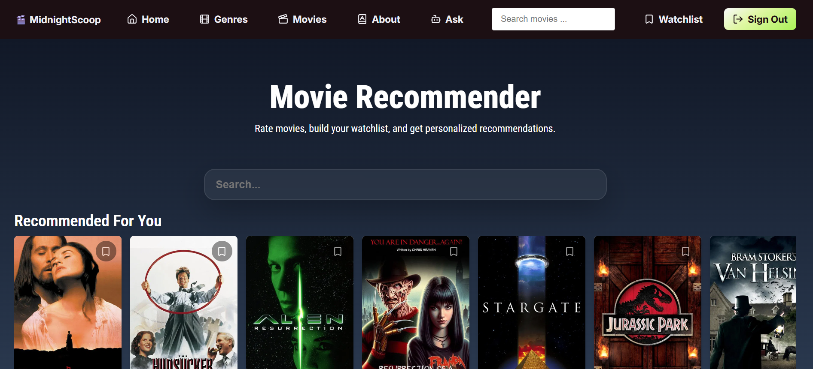
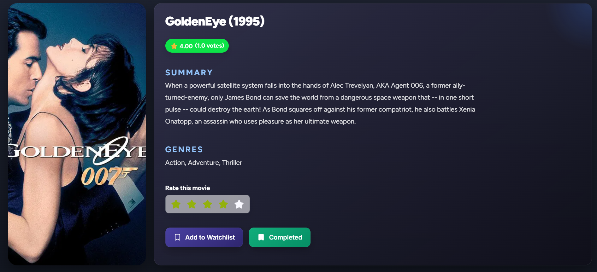
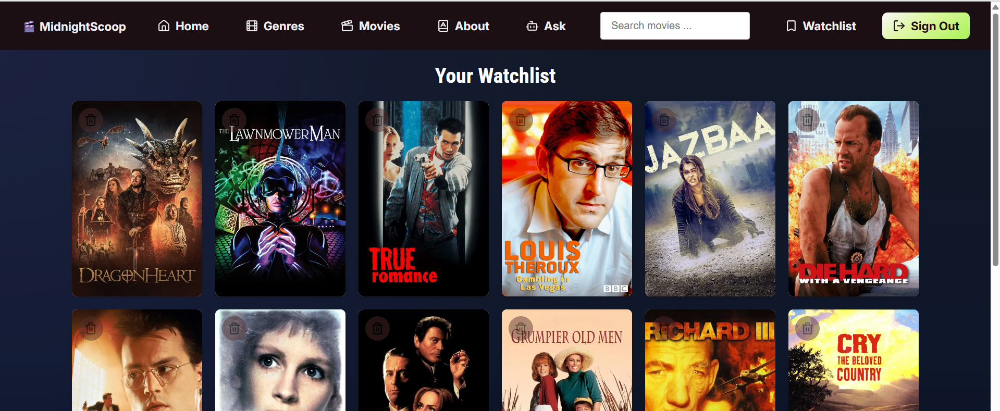
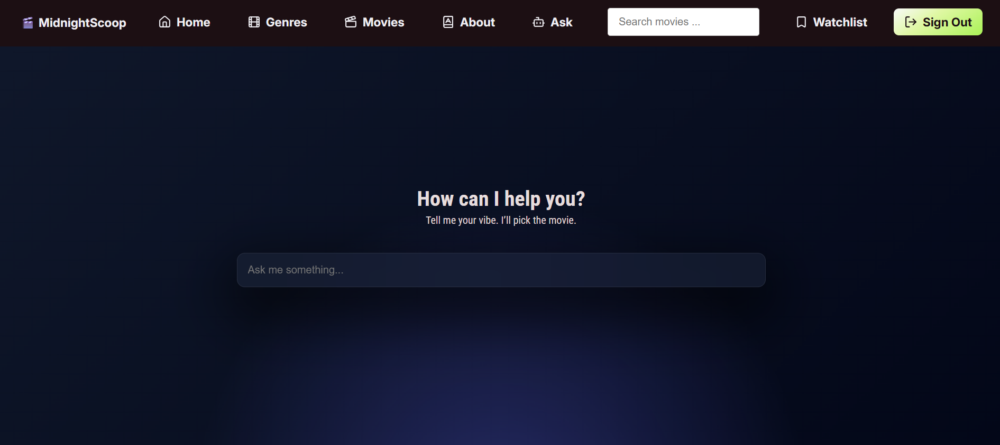

# Table of Contents

- [Overview](#overview)
- [Features](#features)
- [Screenshots](#screenshots)
- [Architecture](#architecture)
- [Recommendation Engine](#recommendation-engine)
- [Tech Stack](#tech-stack)
- [Project Structure](#project-structure)
- [REST API](#rest-api)
- [Installation](#installation)
- [Environment Variables](#environment-variables)
- [Roadmap](#roadmap)
- [License](#license)

  
<div align="center">

# 🎬 Midnight Scoop

### A Full-Stack Movie Recommendation Platform powered by Machine Learning


</div>

## Overview
Midnight Scoop is a full-stack movie recommender platform that allows users to discover films through personalized machine learning recommendations.
The app provides collaborative based filtering and content based filtering to solve both personalized recommendations and the cold-start problem while providing a responsive React frontend backed by Flask REST API.

## Features

| Feature | Description |
|----------|---------------|
| 🔍 Smart Search | Search over 250k movies with instant results|
| ⭐ Ratings | Rate movies from 1-5 stars |
| ❤️ Watchlist | Save movies to watch later |
| 🤖 Personalized Recommendations | Hybrid recommendation engine using collaborative and content-based filtering |
| 🎯 Because You Watched | Discover similar movies based on your viewing history |
| 📱 Responsive Design | Optimized for Desktop, tablet, and mobile |
| 🔐 JWT Authentication | Secure login and protected routes |
| 💬 AI Movie Chatbot | Ask natural language questions about movies |

## Screenshots

| Home | Details |
|-------------|---------------|
|  |  |

| watchlist | chatbot |
|---------------|--------------|
|  |  |

## Architecture
```text
             React Frontend
                    │
          REST API Requests
                    │
              Flask Backend
                    │
        Recommendation Engine
          ├──────────────┐ 
          │              │
Content-Based      Collaborative
 Filtering           Filtering
          │              │
          └──────┬───────┘
                 │
            PostgreSQL
```
## Recommendation Engine

### Collaborative Filtering
Uses latend factor matrix factorization to generate personalized recommendations from user rating behavior.

### Content Based Filtering
Uses TF-IDF vectorization and nearest neighbors to recommend movies similar to those the user has previously enjoyed.

### Cold-Start Strategy
| User Activity | Recommendation Method |
|-------------------|--------------------|
| 0 Ratings | Popular Movies |
| 1-4 Ratings | Content-Based Filtering |
| 5+ Ratings | Collaborative Filtering |

## Tech Stack
| Layer | Technology |
|----------|-------------|
| Frontend | React, React Router |
| Backend | Flask, SQLAlchemy |
| Database | PostgreSQL |
| Machine Learning | NumPy, Scikit-Learn |
| Authentication | JWT |
| Deployment | React, Vercel |
| Model Hosting | Hugging Face | 

## Installation

### Clone Repository
```bash
git clone https://github.com/JonBuwembo/movie-recommender.git

cd movie-recommender
```

### Run Server (Backend)
Navigate to the backend folder to run the flask server:

```bash
cd backend
pip install -r requirements.txt
flask run
```

### Run Frontend
Navigate to the frontend directory then run react:

```bash
cd frontend
npm install
npm start
```

## Roadmap
- [x] User authentication
- [x] Watchlists
- [x] Ratings
- [x] Content-based recommendations
- [x] Collaborative filtering
- [x] Responsive mobile interface
- [x] Recommendation explanations
- [ ] Redis caching
- [ ] Docker support
- [ ] Admin dashboard

## License

This project is licensed under the MIT License

